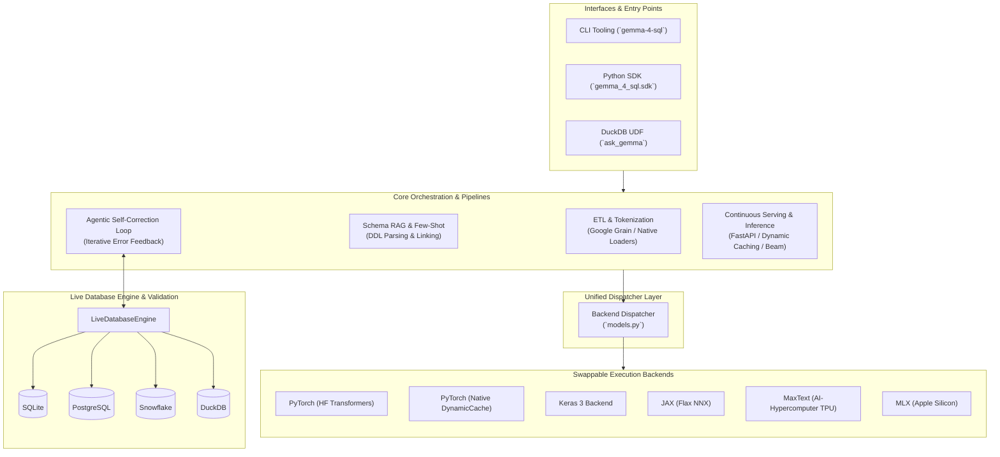

gemma-4-sql
===========

 <!-- badges -->   <!-- /badges -->

Natural text to SQL with Gemma 4; with DuckDB support and swappable-backends: PyTorch (HF); PyTorch (Native); Keras ; JAX; JAX / MaxText; MLX (Apple Silicon).

**Documentation:**
- [Extending / Custom Backends](EXTENDING.md)
- [Deployment & CI/CD](DEPLOY.md)
- [DuckDB Support](DUCKDB_SUPPORT.md)
- [SQL Dataset Analysis](SQL_DATASET_ANALYSIS.md)
- [Architecture Details](ARCHITECTURE.md)
- [Usage Guide](USAGE.md)

`gemma-4-sql` is a comprehensive SDK and CLI framework designed for the end-to-end Text-to-SQL lifecycle with Gemma 4. It unifies dataset ingestion (via Google's `grain` and native data loaders), pre-training, supervised fine-tuning (SFT), and preference optimization (DPO) across six swappable backends—spanning local Apple Silicon (MLX), PyTorch, Keras 3, and distributed AI-Hypercomputer TPUs (JAX and MaxText). Beyond training, it delivers production-ready inference and continuous serving, schema-aware RAG, an agentic self-correcting execution loop against live databases (SQLite, PostgreSQL, Snowflake, DuckDB), and an embedded DuckDB UDF extension for in-database analytics.

## System Architecture

We explicitly integrate with and support the following Gemma 4 model architectures across different ecosystems:
*   **PyTorch (HF)**: Directly imports and uses `Gemma4ForCausalLM` from **[Hugging Face Transformers](https://github.com/huggingface/transformers/tree/main/src/transformers/models/gemma4)**;
*   **PyTorch (Native)**: A custom, from-scratch implementation of Gemma 4 built with **Native PyTorch** (`torch.nn`) featuring `DynamicCache` KV generation and direct safetensors serialization;
*   **MaxText**: Integrates with Google's **[AI-Hypercomputer MaxText](https://github.com/AI-Hypercomputer/maxtext)** framework; dynamically generates Gin configs, orchestrates multi-host TPU Pod training (`maxtext.train`) over multi-dimensional device meshes, uses Google **AQT** (`aqt.jax.v2`) for INT8/INT4 quantization, and operates on functional Linen/JAX parameter PyTrees;
*   **JAX**: A custom, from-scratch implementation of the full Gemma 4 architecture built with **Flax NNX** featuring `@nnx.jit` execution, `nnx.value_and_grad`, dynamic KV caching, `nnx.LoRALinear` adapters, and native Activation-aware Weight Quantization (AWQ) and uniform INT8;
*   **Keras**: Directly imports and uses `GemmaCausalLM` from **[KerasNLP](https://keras.io/keras_nlp/)**;
*   **MLX**: Native Apple Silicon implementation for optimized training, DPO, quantization, and continuous serving on macOS.

### Feature Support Matrix

| Feature | PyTorch (HF) | PyTorch (Native) | Keras 3 Backend | JAX | MaxText | MLX |
| :--- | :--- | :--- | :--- | :--- | :--- | :--- |
| **ETL (Data Loading)** | ✅ Native `DataLoader` | ✅ Native `DataLoader` | ✅ Grain + `BaseFormatTransform` | ✅ Grain + `BaseFormatTransform` | ✅ Grain + `MaxTextFormatTransform` | ✅ Native Batching |
| **Training (Fit/JIT)** | ✅ `Gemma4ForCausalLM` | ✅ Native `torch.nn.Module` | ✅ `keras.Model.fit()` | ✅ `@nnx.jit` loop | ✅ `@jax.jit` / `maxtext.train` | ✅ `mx.compile` |
| **PEFT / LoRA** | ✅ `peft` | ✅ `peft` | ✅ Native Keras | ✅ Flax NNX `LoRALinear` | ✅ Functional PyTree LoRA | ✅ MLX LoRA |
| **Quantization** | ✅ AWQ / BitsAndBytes | ✅ Native INT8 / AWQ | ✅ Keras INT8 | ✅ Native AWQ / INT8 | ✅ Google AQT (INT8/INT4) | ✅ 4-bit / 8-bit Group |
| **Inference (Beam)** | ✅ Tensor-based Search | ✅ DynamicCache Search | ✅ TF Native Search | ✅ Compiled `argsort` | ✅ Compiled `argsort` | ✅ MLX Greed/Beam |
| **Evaluation (DB)** | ✅ Live `sqlite3` Loop | ✅ Live `sqlite3` Loop | ✅ Live `sqlite3` Loop | ✅ Live `sqlite3` Loop | ✅ Live `sqlite3` Loop | ✅ Live `sqlite3` Loop |
| **Export (Ckpt)** | ✅ `safetensors` | ✅ `safetensors` | ✅ `.keras` v3 format | ✅ `orbax` Checkpointer | ✅ `orbax` Checkpointer | ✅ `safetensors` |
| **Agentic Loop** | ✅ Self-Correction | ✅ Self-Correction | ✅ Self-Correction | ✅ Self-Correction | ✅ Self-Correction | ✅ Self-Correction |

*Note on ETL differences:* JAX, MaxText, and Keras all leverage Google's `grain` library. While JAX and Keras use a shared `BaseFormatTransform` yielding standard `inputs` and `targets`, MaxText uses `MaxTextFormatTransform` to inject additional Seq2Seq features like `segment_ids` and `positions` expected by the MaxText architecture. Distributed environments use `JAXDistributedSharding`. All training commands support configurable `--batch-size` arguments.

### CLI Output & Interaction

All CLI commands support direct standard output (stdout) reporting:
*   `gemma-4-sql generate --prompt "..."`: Prints clean SQL directly to stdout.
*   `gemma-4-sql agent --prompt "..."`: Emits JSON execution status, retry count, and final verified SQL.
*   `gemma-4-sql chat --prompt "..."`: Prints multi-turn conversational SQL assistant response.
*   `gemma-4-sql evaluate --dataset "..."`: Displays formatted evaluation metrics table.
*   `gemma-4-sql tokenize --encode "..."`: Emits JSON token IDs array.
*   `gemma-4-sql execute --query "..."`: Outputs query execution results and error status.

## Documentation & Usage

For full instructions on Installation, Development, ETL, Training, Inference, and other workflows, please see the **[Usage Guide](USAGE.md)**.

For a comprehensive guide on running these training scripts across distributed infrastructure (like Google Cloud TPU VMs) using MaxText or JAX, please refer to the **[DEPLOY_TO_TPU.md](./DEPLOY_TO_TPU.md)** file.

---

## License

Licensed under either of

- Apache License, Version 2.0 ([LICENSE-APACHE](LICENSE-APACHE) or <https://www.apache.org/licenses/LICENSE-2.0>)
- MIT license ([LICENSE-MIT](LICENSE-MIT) or <https://opensource.org/licenses/MIT>)

at your option.

### Contribution

Unless you explicitly state otherwise, any contribution intentionally submitted
for inclusion in the work by you, as defined in the Apache-2.0 license, shall be
dual licensed as above, without any additional terms or conditions.
